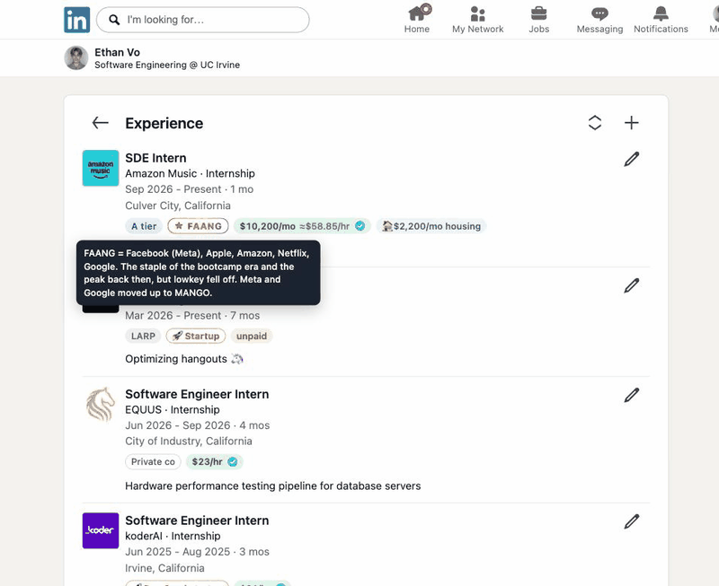

# Pocket Watching ⌚

[Watch in higher quality (MP4)](docs/demo.mp4)

A Chrome extension that adds a little context under the career moves on a LinkedIn profile: what the company is, roughly what the role pays, and a compliment when it's earned.

It's for curiosity about tech careers (internships, new-grad and early-career jobs), mostly your own and your friends'. It isn't a background check.

> **Heads up:** this was made as a joke, and for pay transparency. Don't use it to spread hate or demean anyone. Everyone's path is different, and a badge on a LinkedIn page says nothing about a person's worth.

## What it does

Open any LinkedIn profile (or its full Experience / Education page) and badges appear under each entry.

**Jobs**
- **Pay.** Internships and part-time roles show hourly pay, or a monthly salary when that's how it's quoted (`$10,200/mo ≈$58.85/hr`). Housing stipends are shown alongside. Full-time roles show yearly total compensation at the new-grad level unless the title says otherwise (`$195K TC E3`).
- **Company type.** MANGO, FAANG, FAANG-adjacent, FAANG-lite, Quant, Hedge Fund, AI Lab, Fintech, Big Tech, Unicorn, Startup (with its funding round when known), Y Combinator batch, University position, Student org and so on.
- **Compliments.** THANOS, S and A tier appear only on standout roles (top quant firms, MANGO, FAANG and similar). Lower tiers are never shown.
- **LARP.** Flags wildly inflated titles, like "Member of Technical Staff" at a school club or "CEO" of an app with no users. Ordinary club roles and titles never get it.
- **Unpaid / unverified.** Clubs, volunteering and personal projects read "unpaid". Companies that can't be found online read "unverified".

**Schools**
- A compliment tier for standout programs (school *and* major matter) plus a short label like "Top 5 CS".
- How long undergrad took, community college included: early grad, on time, super senior, SUPER DUPER SENIOR.

**Confirmed vs. estimated pay**
- **Confirmed** is pay you entered yourself (from an offer letter, say). It's exact, permanent and shows a blue check with its source ("Confirmed · Fall 2026 offer"). Pay is location-specific: a Seattle offer only confirms Seattle.
- **Estimated** is everything else, found by Gemini with Google Search and tagged `approx.` (pay found for that company and role), `est. mkt` (typical pay for the title when nothing company-specific turns up) or `median` (the median of known US locations for that role, used when nothing better turns up). Hover any pay badge to see what kind of estimate it is and where it came from.
- **Community** pay is real offers people submitted to this repo through pull requests ([`community-pay.json`](community-pay.json)). It shows an outlined check and a `community` tag, and fills in wherever you haven't confirmed anything yourself. Want to add yours? See [CONTRIBUTING.md](CONTRIBUTING.md).
- Settings lets you browse every estimate, fix wrong ones, promote them to confirmed, or delete them.

**Settings** (click the extension icon)
- Gemini API key and model
- Import a profile by link and fill in pay for each job
- Known pay (confirmed pay, plus unconfirmed "reference only" numbers)
- Estimates browser
- Per-badge on/off switches
- Data: confirmed and estimated are stored separately, with backup export/restore for confirmed

## What it doesn't do

- **It doesn't know anyone's actual pay.** Unless you've confirmed a number yourself, every figure is an estimate of what the role typically pays, not what that person earned.
- **It doesn't track everyday jobs.** Cashier, barista, retail, food service, delivery driving, lifeguarding and similar jobs get no badges and aren't sent to Gemini. We're not trying to pocket-watch those.
- **It doesn't crawl LinkedIn.** It only reads profiles you open yourself. The one exception is Import, which opens a single profile's Experience page in a background tab when you ask it to.
- **It doesn't change anything on LinkedIn.** No messages, no connection requests, no edits. Badges only exist on your screen.
- **It doesn't have a server or an account.** Everything is stored in your Chrome profile.
- **It isn't affiliated with LinkedIn, Google or any company it labels.**

## What it doesn't aim to do

- **Rank people.** Tiers only appear as compliments. Most entries get none, and that says nothing bad about them.
- **Replace salary sites.** It borrows from Levels.fyi, Glassdoor and similar sources. For decisions like negotiating an offer, go to the source.
- **Be a recruiting, hiring or screening tool.** Don't use it to judge candidates or make decisions about people.
- **Be perfectly accurate.** Categories, tiers and LARP flags are judgment calls from a language model. When one is wrong, fix it in Settings → Estimates.

## Privacy

To make an estimate, the text of the entry being looked up (title, company, dates, location, description) plus the person's headline and Education section is sent to the Google Gemini API using your own API key, under Google's terms. The extension also downloads `community-pay.json` from GitHub (nothing is sent). Nothing else leaves your browser. See [PRIVACY.md](PRIVACY.md). Results are cached locally, so revisiting a profile doesn't send it again.

## Cost

It runs on your own Gemini API key. With Gemini 2.5 Flash, a lookup costs about $0.002 in tokens, and web searches are free up to 1,500 a day (then $35 per 1,000). A typical profile is around 10 lookups, so normal use is effectively free. Revisits, confirmed pay and community pay cost nothing, and school lookups don't use web search.

To be safe, it stops new lookups for the day at **1,000 web searches or 2,000 lookups**. Background pay double-checks stop at 80% of the search limit. Settings → Data shows today's usage and estimated cost, and lets you change the limits. When you hit one, click **allow 500 more** on the badge (or in Settings) to keep going for the rest of the day. On a free-tier key with no billing, it costs nothing but Google may use requests to improve its products.

## Install

1. Clone this repo: `git clone https://github.com/ethnvo/pocket-watching.git`
2. Get a free Gemini API key at https://aistudio.google.com/apikey.
3. In Chrome, go to `chrome://extensions`, turn on **Developer mode** and click **Load unpacked**, then choose this folder.
4. Paste the key on the settings page that opens, then open any LinkedIn profile.

After pulling changes, click the reload icon on the extension in `chrome://extensions` and refresh LinkedIn.

## How it works

- `content.js` finds Experience and Education entries on LinkedIn pages and draws the badges.
- `background.js` calls Gemini, applies confirmed pay, location rules and the median fallback, and caches results.
- `options.html`, `options.css` and `options.js` are the settings page.
- `community-pay.json` is community pay, fetched from GitHub about once a day. `scripts/validate-community.mjs` checks it on every pull request.
- `seed-pay.json` and `seed-companies.json` are pay and company overrides loaded on install. Your own entries live in Chrome storage.
- `scripts/package.sh` builds the Chrome Web Store zip into `dist/`. The listing text, permission justifications and privacy answers are in [`store/LISTING.md`](store/LISTING.md).

## Testing

`npm install` once, then:

- `npm test` runs the real extension code against fake LinkedIn pages and fake Gemini answers
  (no network, no API key, a few seconds). Every case is checked against the rules in
  `tests/invariants.mjs`: no `NaN`/`undefined` in badges, no "est." next to a blue check,
  clubs unpaid, internships never annualized, and so on.
- `GEMINI_API_KEY=… npm run eval` runs `eval/profiles.json` through the real Gemini prompt
  (~15–30 calls) and saves failing answers to `eval/out/`.

Saw a wrong badge? Save the entry and the model's answer as a file in
`tests/fixtures/model/` (see the others; `"$base": "intern"` fills in the boring fields),
or add a rule to `tests/invariants.mjs`, watch it fail, then fix it.

## Contributing

Issues and pull requests are welcome, especially offers for community pay. See [CONTRIBUTING.md](CONTRIBUTING.md).

## License

[MIT](LICENSE) © 2026 Ethan Vo
